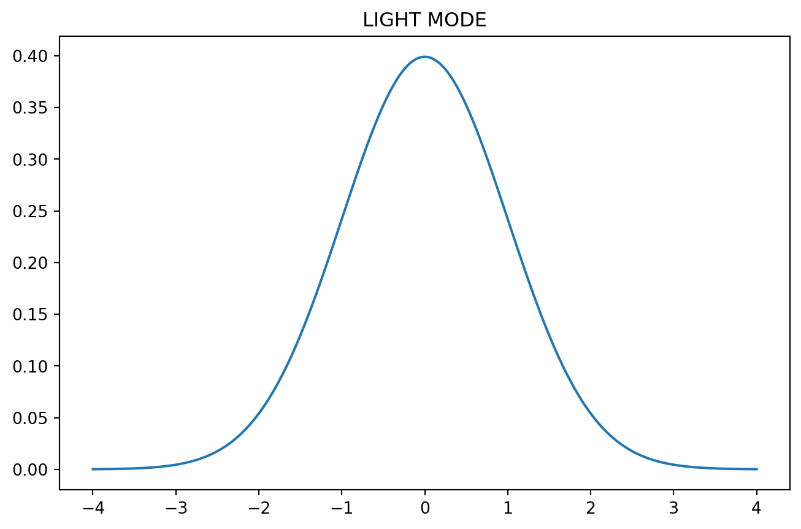
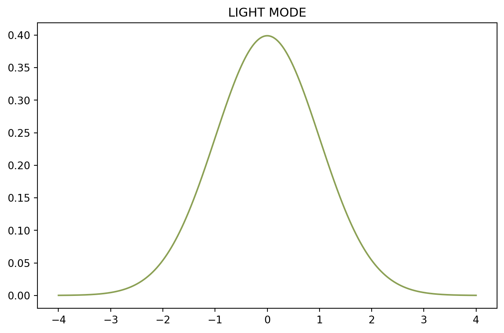
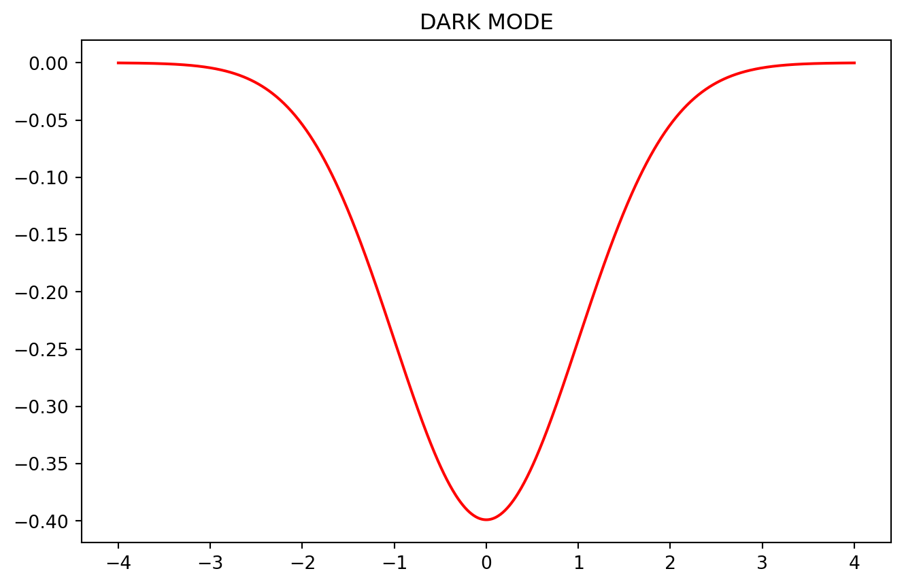

Dark mode is enabled by providing dark and light to theme in the `_quarto.yml` file.

The default toggle is very small, it's been customised from [following advice on GitHub](https://github.com/quarto-dev/quarto-cli/discussions/7924#discussioncomment-7987263)............

### No crossref or caption

::: {#5419212e .cell renderings='["light","dark"]' execution_count=1}

::: {.cell-output .cell-output-display}
{width=653 height=431}
:::

::: {.cell-output .cell-output-display}
{width=665 height=431}
:::
:::

# Accessing colours from brand palette

::: {#47c9a229 .cell renderings='["light","dark"]' execution_count=2}

::: {.cell-output .cell-output-display}
{width=653 height=431}
:::

::: {.cell-output .cell-output-display}
{width=665 height=431}
:::
:::

