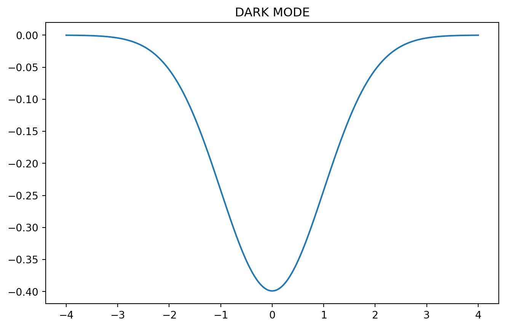

### No crossref or caption

::: {#ca33d1d2 .cell renderings='["light","dark"]' execution_count=1}

::: {.cell-output .cell-output-display}
{width=653 height=431}
:::

::: {.cell-output .cell-output-display}
{width=665 height=431}
:::
:::

# Accessing colours from brand palette

::: {#517e7242 .cell renderings='["light","dark"]' execution_count=2}

::: {.cell-output .cell-output-display}
{width=653 height=431}
:::

::: {.cell-output .cell-output-display}
{width=665 height=431}
:::
:::

